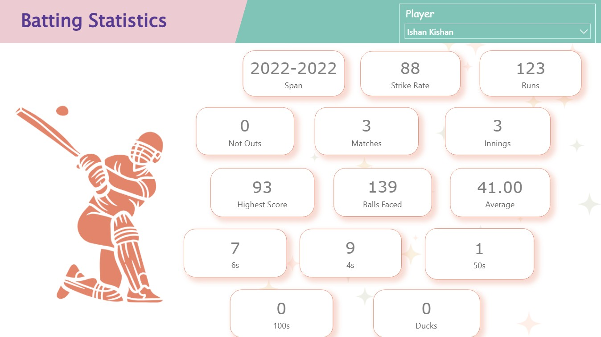
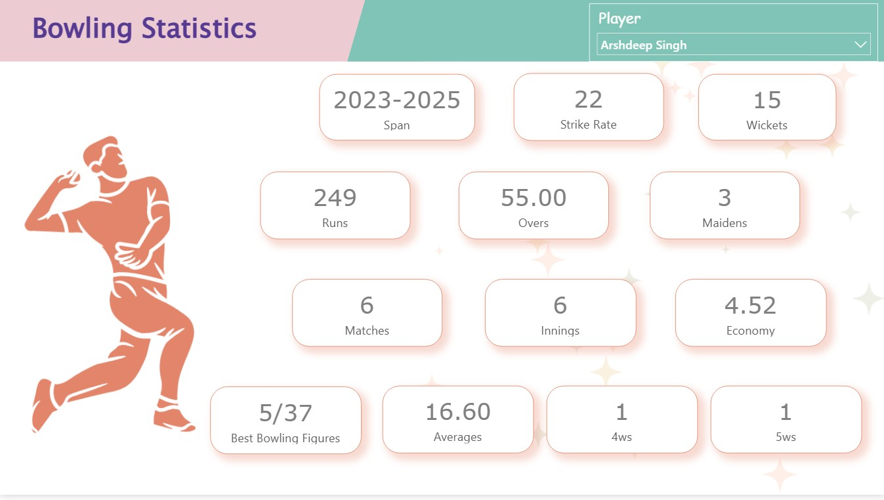
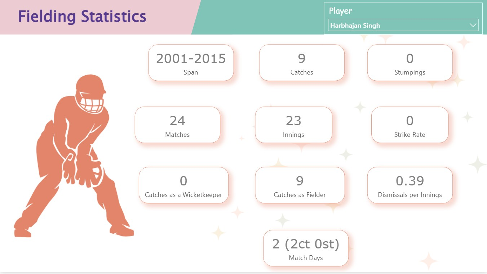

# 🏏 Cricket Performance Analytics

A professional Power BI analytics project designed to evaluate player performance across batting, bowling, and fielding disciplines using historical cricket statistics.

This dashboard helps teams, coaches, analysts, and cricket enthusiasts assess player contributions, compare skill sets, and support performance-driven decisions.

---

# 📌 Business Objective

Cricket organizations and analysts require visibility into player performance metrics to optimize team selection, monitor player development, and improve match strategy.

This dashboard enables stakeholders to:

- Analyze batting, bowling, and fielding performance  
- Compare players across multiple skill dimensions  
- Identify top performers and specialists  
- Track historical career statistics  
- Support squad selection decisions  
- Use analytics for performance planning

---

# 📊 Dashboard Coverage

## Batting Analytics

- Runs scored overview  
- Strike rate analysis  
- Highest score comparison  
- Boundary statistics  
- Average performance insights  

## Bowling Analytics

- Wickets performance  
- Economy rate analysis  
- Best bowling figures  
- Bowling averages  
- Match contribution trends  

## Fielding Analytics

- Catches analysis  
- Stumpings overview  
- Dismissals per innings  
- Wicketkeeper vs fielder contribution  
- Match impact insights  

---

# 🔍 Key Insights

## Player Performance Insights

- Specialist players excelled in their core disciplines.  
- Batting strike rate and consistency varied significantly.  
- Bowling efficiency highlighted match-winning impact.  
- Fielding metrics reflected valuable support contribution.  
- Multi-skill comparisons supported balanced team selection.

## Strategic Insights

- All-rounders created stronger squad balance.  
- Aggressive batters improved scoring acceleration.  
- Efficient bowlers strengthened defense.  
- Strong fielders improved overall team efficiency.  
- Historical data supported smarter future planning.

---

# 🛠 Tools & Skills Used

- Power BI  
- Power Query  
- DAX  
- Data Modeling  
- Sports Analytics  
- Data Cleaning  
- KPI Reporting  
- Dashboard Design  
- Business Storytelling  
- Comparative Analysis  

---

# 📸 Dashboard Screenshots

## 🏏 Batting Performance Dashboard

  

Analyzes runs, strike rate, boundaries, averages, and batting consistency.

---

## 🎯 Bowling Performance Dashboard

  

Highlights wickets, economy, bowling efficiency, and match impact metrics.

---

## 🧤 Fielding Performance Dashboard

  

Tracks catches, stumpings, dismissals, and fielding effectiveness.

---

# 🎯 Business Impact

This dashboard helps teams and analysts:

- Improve player selection decisions  
- Compare players objectively  
- Identify specialists and all-rounders  
- Support match strategy planning  
- Track historical performance trends  
- Enable data-driven cricket insights

---

# 🚀 What This Project Demonstrates

- Sports analytics understanding  
- KPI dashboard creation  
- Multi-page Power BI reporting  
- Comparative player analysis  
- Executive reporting mindset  
- Business storytelling with visuals  
- Performance analytics capability

---

# 🔗 Connect With Me

- LinkedIn: https://www.linkedin.com/in/shaurya-nanda/  
- Portfolio: https://shauryananda3.github.io/  
- GitHub: https://github.com/shauryananda3

---
