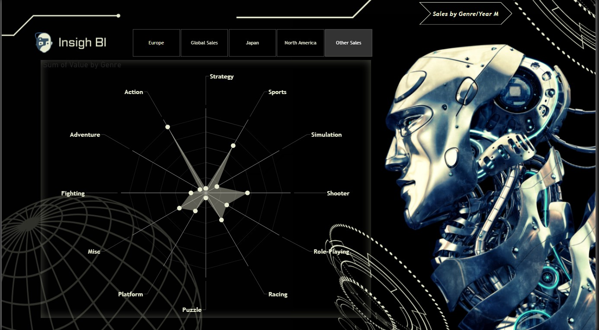
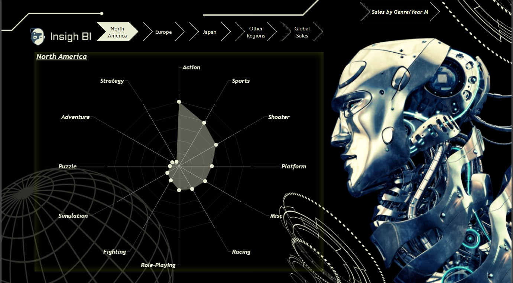
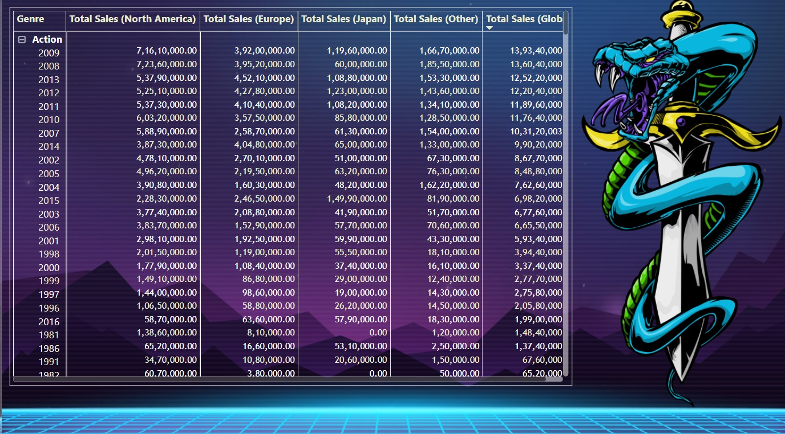
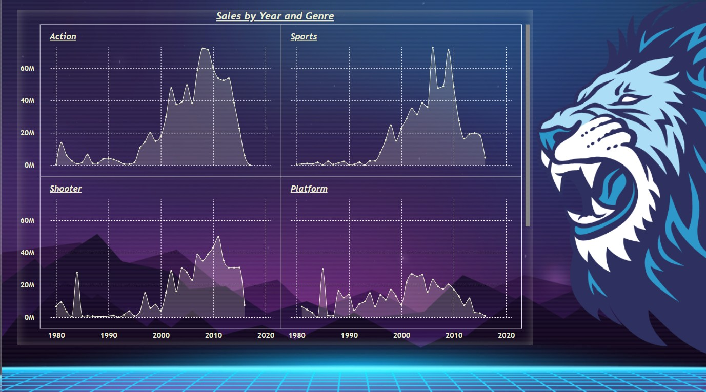

# 🎮 Gaming Industry Sales Analytics

A professional Power BI analytics project designed to evaluate video game sales performance across genres, regions, and yearly market trends.

This dashboard helps gaming companies, publishers, and analysts understand consumer demand, regional preferences, and high-performing genres to support strategic business decisions.

---

# 📌 Business Objective

Gaming businesses require visibility into sales trends, regional demand, and genre performance to optimize product strategy and maximize revenue opportunities.

This dashboard enables stakeholders to:

- Analyze game sales by genre and region  
- Compare North America, Europe, and global sales trends  
- Identify top-performing gaming categories  
- Evaluate yearly sales movement across genres  
- Understand regional customer preferences  
- Support launch and portfolio decisions using analytics

---

# 📊 Dashboard Coverage

## Sales Performance Analytics

- Global sales overview  
- Regional sales comparison  
- Genre-wise revenue contribution  
- Yearly sales trend analysis  
- Market performance insights  

## Market Insights

- North America demand trends  
- Europe sales movement  
- Global sales summary  
- Cross-market genre comparison  
- Historical category performance  

---

# 🔍 Key Insights

## Sales Insights

- Action and Sports categories showed strong demand.  
- Regional preferences varied significantly by market.  
- Some genres consistently outperformed others across years.  
- Global sales were concentrated in select categories.  
- Historical trend analysis highlighted peak gaming periods.

## Market Insights

- North America remained a major revenue contributor.  
- Europe delivered balanced category performance.  
- Genre-focused launches improve revenue potential.  
- Regional diversification supports growth strategy.  
- Data-backed insights improve portfolio planning.

---

# 🛠 Tools & Skills Used

- Power BI  
- Power Query  
- DAX  
- Data Modeling  
- Entertainment Analytics  
- Data Cleaning  
- KPI Reporting  
- Dashboard Design  
- Business Storytelling  
- Trend Analysis  

---

# 📸 Dashboard Screenshots

## 🌍 Europe Genre Sales Dashboard

  

Analyzes top-performing game genres across the European market.

---

## 🌎 North America Genre Sales Dashboard

  

Highlights category demand and genre popularity across North America.

---

## 📋 Global Sales Summary Table

  

Summarizes regional and global sales contribution by genre and year.

---

## 📈 Yearly Genre Sales Trends

  

Tracks historical sales movement across major gaming categories.

---

# 🎯 Business Impact

This dashboard helps gaming businesses:

- Improve game launch planning  
- Identify profitable genres and markets  
- Understand regional customer preferences  
- Optimize portfolio strategy  
- Support expansion decisions  
- Enable data-driven revenue planning

---

# 🚀 What This Project Demonstrates

- Entertainment analytics understanding  
- KPI dashboard creation  
- Multi-region performance reporting  
- Trend analysis capability  
- Executive reporting mindset  
- Business storytelling with visuals  
- Revenue strategy analytics

---

# 🔗 Connect With Me

- LinkedIn: https://www.linkedin.com/in/shaurya-nanda/  
- Portfolio: https://shauryananda3.github.io/  
- GitHub: https://github.com/shauryananda3

---
