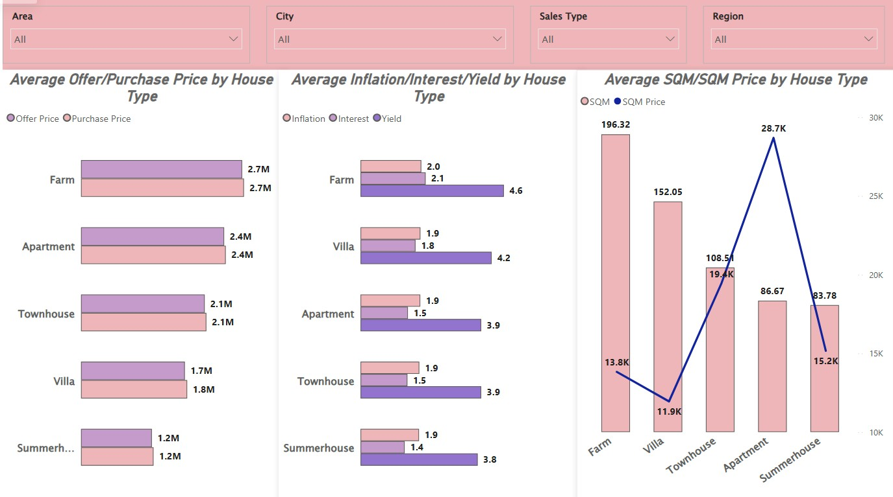
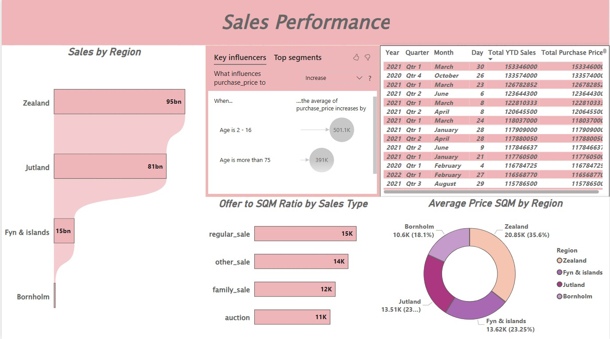

# 🏠 Housing Market Trends Analytics

A professional Power BI analytics project designed to evaluate real estate pricing trends, regional sales performance, housing demand patterns, and property market behavior.

This dashboard helps investors, developers, and market analysts understand pricing movements, identify growth regions, and support data-driven property decisions.

---

# 📌 Business Objective

Real estate stakeholders need visibility into pricing trends, regional demand, and sales performance to improve investment planning and market strategy.

This dashboard enables stakeholders to:

- Analyze housing price movement across regions  
- Monitor regional sales performance  
- Compare offer price vs purchase price trends  
- Identify high-growth property markets  
- Evaluate property type performance  
- Support strategic investment decisions using analytics

---

# 📊 Dashboard Coverage

## Market Performance Analytics

- Housing market overview  
- Regional sales trends  
- Price growth by region  
- Units sold analysis  
- Offer vs purchase price comparison  

## Property Insights

- Property type pricing comparison  
- Sales by region / area / city  
- Yield and market indicators  
- House type demand patterns  
- Segment trend analysis  

---

# 🔍 Key Insights

## Market Insights

- Certain regions consistently outperformed others in price growth.  
- Sales demand was concentrated in select markets.  
- Offer prices closely aligned with purchase prices in active areas.  
- Regional trends supported targeted investment planning.  
- Market movement highlighted strong growth opportunities.

## Property Insights

- Property type significantly influenced pricing levels.  
- Urban regions showed stronger transaction activity.  
- Segment analysis supported diversified investments.  
- Yield indicators impacted market attractiveness.  
- Data-backed insights improved buying strategy.

---

# 🛠 Tools & Skills Used

- Power BI  
- Power Query  
- DAX  
- Data Modeling  
- Real Estate Analytics  
- Data Cleaning  
- KPI Reporting  
- Dashboard Design  
- Business Storytelling  
- Trend Analysis  

---

# 📸 Dashboard Screenshots

## 🏠 Housing Market Overview

  

Provides a complete view of market pricing trends, units sold, and housing demand movement.

---

## 🏘 Property Type Price Analysis

  

Compares property categories using pricing, market indicators, and performance trends.

---

## 📈 Regional Sales Performance

  

Analyzes regional sales contribution, top markets, and pricing behavior.

---

# 🎯 Business Impact

This dashboard helps real estate stakeholders:

- Improve investment planning decisions  
- Detect high-growth property markets  
- Compare pricing trends across regions  
- Understand demand movement and sales patterns  
- Optimize portfolio allocation  
- Enable smarter strategic decisions

---

# 🚀 What This Project Demonstrates

- Real estate analytics understanding  
- KPI dashboard creation  
- Market trend analysis  
- Regional performance reporting  
- Executive reporting mindset  
- Business storytelling with visuals  
- Investment decision analytics

---

# 🔗 Connect With Me

- LinkedIn: https://www.linkedin.com/in/shaurya-nanda/  
- Portfolio: https://shauryananda3.github.io/  
- GitHub: https://github.com/shauryananda3

---
