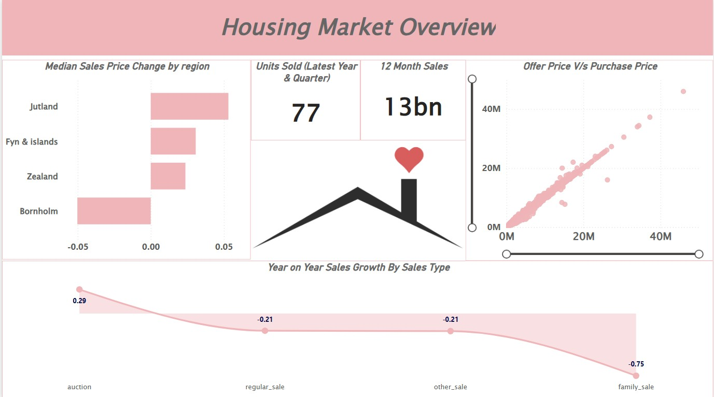

# 🏠 Housing Market Trends Analytics

A professional Power BI analytics project designed to evaluate real estate pricing trends, regional sales performance, housing demand patterns, and property market behavior.

This dashboard helps real estate businesses, investors, and market analysts understand pricing movements, identify demand hotspots, and support data-driven investment decisions.

---

# 📌 Business Objective

Real estate stakeholders require visibility into property prices, sales trends, and regional demand to optimize investment planning and market strategy.

This dashboard enables stakeholders to:

- Analyze housing price movement across regions  
- Monitor sales performance and property demand  
- Compare offer price vs purchase price trends  
- Identify high-performing markets and segments  
- Evaluate property type behavior  
- Support strategic investment decisions using analytics

---

# 📊 Dashboard Coverage

## Market Performance Analytics

- Regional housing sales trends  
- Price growth by region  
- Units sold performance  
- Offer vs purchase price analysis  
- Year-on-year sales movement  

## Property Insights

- House type comparison  
- Average pricing by property type  
- Sales by city / area / region  
- Yield, interest, and inflation analysis  
- Property segment trends  

---

# 🔍 Key Insights

## Market Insights

- Certain regions consistently outperformed others in pricing growth.  
- Sales demand was concentrated in select markets.  
- Offer prices closely aligned with purchase prices in active areas.  
- Some sales types showed stronger growth momentum.  
- Regional trends supported targeted investment planning.

## Property Insights

- Property type significantly influenced average pricing levels.  
- Yield and interest indicators impacted market attractiveness.  
- Urban areas showed stronger transaction activity.  
- Segment analysis supports portfolio diversification decisions.  
- Data-backed insights improve timing of investments.

---

# 🛠 Tools & Skills Used

- Power BI  
- Power Query  
- DAX  
- Data Modeling  
- Real Estate Analytics  
- Data Cleaning  
- KPI Reporting  
- Dashboard Design  
- Business Storytelling  
- Trend Analysis  

---

# 📸 Dashboard Screenshots

## 🏠 Housing Market Overview

  

Provides a complete view of market pricing trends, units sold, and regional sales growth.

---

## 📈 Sales Performance Dashboard

  

Analyzes regional sales performance, top segments, and average property pricing.

---

## 🏘 Property Type Analytics

  

Compares house types using pricing, yield, inflation, and market indicators.

---

# 🎯 Business Impact

This dashboard helps real estate stakeholders:

- Improve investment planning decisions  
- Detect high-growth property markets  
- Compare pricing trends across regions  
- Understand demand movement and sales patterns  
- Optimize portfolio allocation  
- Enable smarter strategic decisions

---

# 🚀 What This Project Demonstrates

- Real estate analytics understanding  
- KPI dashboard creation  
- Market trend analysis  
- Regional performance reporting  
- Executive reporting mindset  
- Business storytelling with visuals  
- Investment decision analytics

---

# 🔗 Connect With Me

- LinkedIn: https://www.linkedin.com/in/shaurya-nanda/  
- Portfolio: https://shauryananda3.github.io/  
- GitHub: https://github.com/shauryananda3

---
