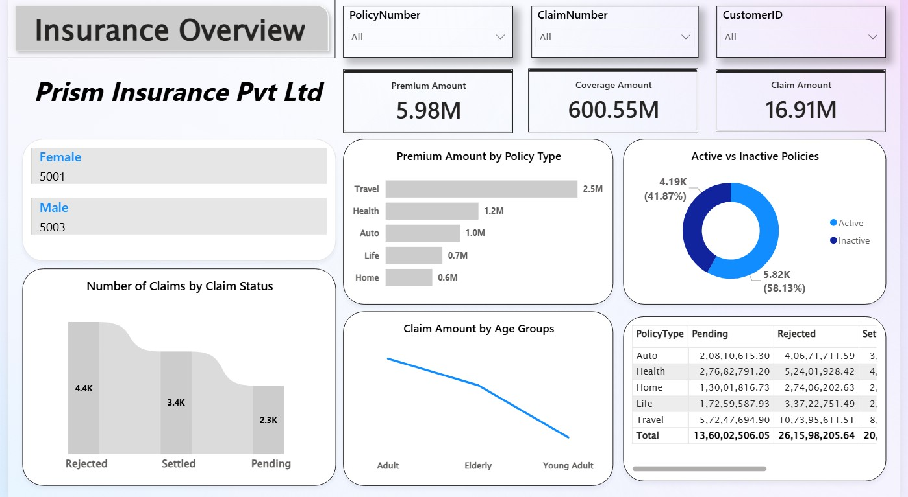
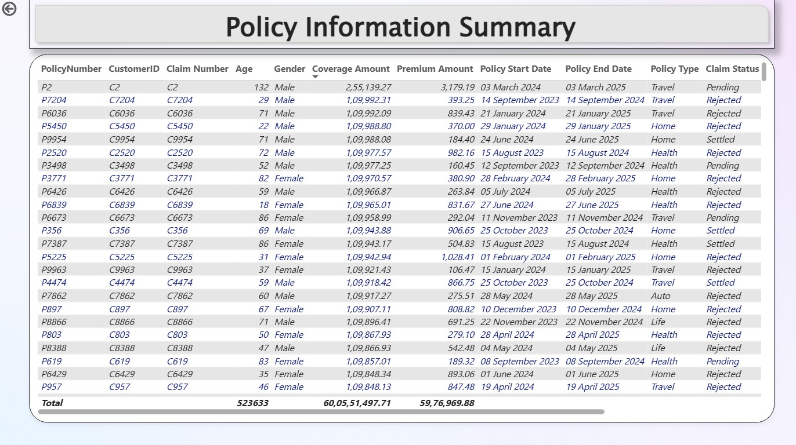
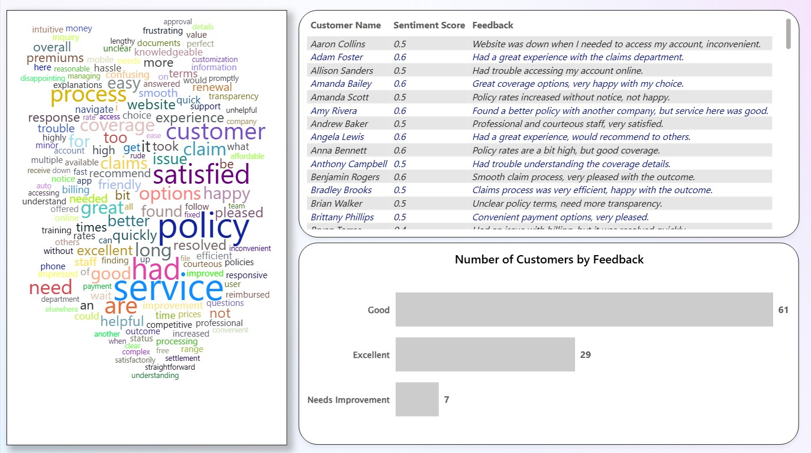

# 🛡️ Insurance Claims, Customer Insights & Policy Performance Analytics

A professional Power BI analytics project designed to evaluate insurance policy performance, claims trends, customer satisfaction, premium collections, and operational efficiency.

This dashboard helps insurance companies improve claims management, monitor policy health, understand customer sentiment, and optimize decision-making through data-driven insights.

---

# 📌 Business Objective

Insurance organizations need strong visibility into policy performance, claims activity, and customer experience.

This report enables stakeholders to:

- Monitor premium, coverage, and claim amounts
- Analyze active vs inactive policies
- Evaluate claim settlement trends
- Review customer demographics
- Track policy-level operational data
- Understand customer feedback sentiment
- Improve claims turnaround and service quality

---

# 📊 KPIs Tracked

## Financial Metrics

- Premium Amount
- Coverage Amount
- Claim Amount

## Policy Metrics

- Active vs Inactive Policies
- Premium Amount by Policy Type
- Policy Details by Customer & Claim Number
- Policy Start Date / End Date Analysis

## Claims Metrics

- Number of Claims by Claim Status
- Claim Amount by Age Group
- Pending / Rejected / Settled Claims by Policy Type

## Customer Metrics

- Gender Distribution
- Customer Feedback Sentiment Score
- Number of Customers by Feedback Category
- Text Feedback Analysis (Word Cloud)

---

# 🔍 Key Insights

## Insurance Performance Insights

- Active policies exceeded inactive policies, indicating healthy retention.
- Travel policies generated the highest premium contribution.
- Coverage value significantly exceeded claim payouts.
- Claim amounts remained concentrated in select age groups.

## Claims Insights

- Rejected claims represented the largest share of claim statuses.
- Settled claims formed a strong operational portion.
- Pending claims indicate scope for turnaround improvement.
- Claim performance varied across policy categories.

## Customer Insights

- Male and female customer base was nearly balanced.
- Most customers rated service as Good or Excellent.
- Needs Improvement feedback was limited but actionable.
- Frequent themes included claims process, service quality, policy options, and support.

---

# 🛠 Tools & Skills Used

- Power BI
- Power Query
- DAX
- Data Modeling
- Data Cleaning
- Claims Analytics
- Customer Analytics
- Sentiment Analysis
- Dashboard Design
- Executive Reporting

---

# 📸 Dashboard Screenshots

## 🏢 Insurance Overview Dashboard

  

Tracks premium revenue, coverage value, claims payout, policy activity, and claim status trends.

---

## 📄 Policy Information Summary

  

Detailed operational view of policy records, customer profiles, premium values, claim numbers, and policy timelines.

---

## 😊 Customer Feedback Dashboard

  

Analyzes sentiment score, customer comments, service feedback, and satisfaction categories.

---

# 🎯 Business Impact

This dashboard helps insurance companies:

- Improve claims settlement efficiency
- Reduce pending claim backlogs
- Monitor profitable policy segments
- Increase customer retention
- Improve service quality using feedback analytics
- Detect operational bottlenecks
- Support management reporting and planning

---

# 🚀 What This Project Demonstrates

- Insurance analytics understanding
- Claims operations reporting
- Customer experience analytics
- Multi-page Power BI dashboarding
- Business storytelling with visuals
- Executive KPI reporting
- Cross-functional business intelligence

---

# 🔗 Connect With Me

- LinkedIn: https://www.linkedin.com/in/shaurya-nanda/
- Portfolio: https://shauryananda3.github.io/
- GitHub: https://github.com/shauryananda3

---
