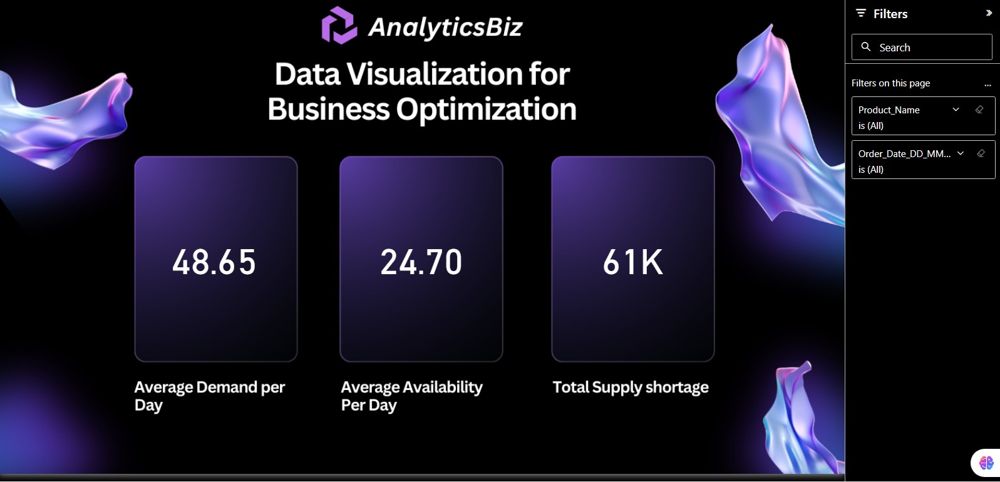
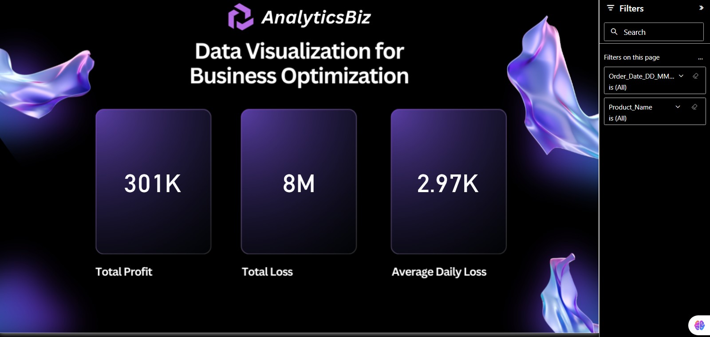

# 📦 Inventory & Supply Chain Analytics

A professional Power BI analytics project designed to evaluate product demand, inventory availability, supply shortages, profit leakage, and operational efficiency using business inventory datasets.

This dashboard helps supply chain teams, operations managers, and business leaders optimize stock planning, reduce shortages, improve profitability, and support data-driven inventory decisions.

---

# 📌 Business Objective

Organizations require visibility into inventory demand, stock availability, losses, and supply performance to improve operational efficiency and business profitability.

This dashboard enables stakeholders to:

- Monitor product demand versus available supply  
- Identify supply shortages and stock gaps  
- Analyze profitability and loss trends  
- Improve replenishment planning  
- Optimize inventory allocation decisions  
- Support business growth using analytics

---

# 📊 Dashboard Coverage

## Inventory Performance Analytics

- Average demand per day  
- Average availability per day  
- Total supply shortage analysis  
- Product-level filtering  
- Date-based inventory monitoring  

## Financial Performance Insights

- Total profit overview  
- Total loss analysis  
- Average daily loss trends  
- Operational gap indicators  
- Supply chain performance tracking  

---

# 🔍 Key Insights

## Inventory Insights

- Demand exceeded availability for select products.  
- Shortage trends highlighted replenishment gaps.  
- Daily monitoring improved stock visibility.  
- Product filtering revealed uneven inventory movement.  
- Supply optimization can reduce missed sales opportunities.

## Financial Insights

- Losses were linked to stock shortages and inefficiencies.  
- Better demand forecasting can improve margins.  
- Operational visibility supports faster decisions.  
- Inventory balance directly impacts profitability.  
- Data-backed planning improves cost control.

---

# 🛠 Tools & Skills Used

- Power BI  
- Power Query  
- DAX  
- Data Modeling  
- Supply Chain Analytics  
- Inventory Analytics  
- Data Cleaning  
- Dashboard Design  
- KPI Reporting  
- Business Storytelling  

---

# 📸 Dashboard Screenshots

## 📦 Inventory Demand & Supply Overview

  

Tracks daily demand, stock availability, and total supply shortage across products.

---

## 💰 Inventory Profit & Loss Analysis

  

Analyzes profitability, operational losses, and average daily loss trends.

---

# 🎯 Business Impact

This dashboard helps businesses:

- Reduce stock shortages  
- Improve replenishment planning  
- Increase inventory efficiency  
- Lower operational losses  
- Improve profit visibility  
- Enable data-driven supply chain decisions

---

# 🚀 What This Project Demonstrates

- Supply chain analytics understanding  
- KPI dashboard creation  
- Inventory optimization reporting  
- Financial impact analysis  
- Executive reporting mindset  
- Business storytelling with visuals  
- Operational analytics capability

---

# 🔗 Connect With Me

- LinkedIn: https://www.linkedin.com/in/shaurya-nanda/  
- Portfolio: https://shauryananda3.github.io/  
- GitHub: https://github.com/shauryananda3

---
