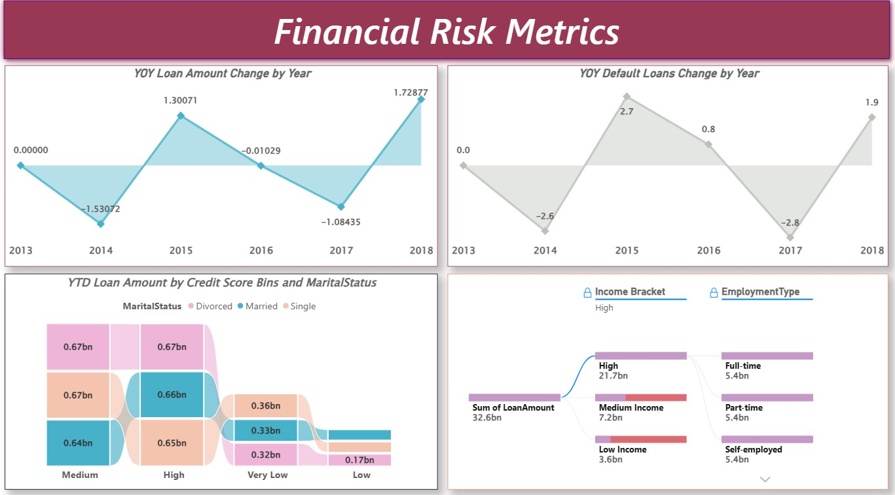

# 💳 Loan Default Risk, Borrower Behavior & Credit Analytics

A professional Power BI analytics project designed to evaluate loan default behavior, borrower demographics, income segments, credit score profiles, and yearly lending risk trends.

This dashboard helps lenders, banks, NBFCs, and fintech organizations identify high-risk borrowers, optimize credit strategy, and improve loan portfolio performance through data-driven decisions.

---

# 📌 Business Objective

Financial institutions need strong visibility into borrower risk patterns, repayment behavior, and lending trends.

This report enables stakeholders to:

- Monitor default rates across borrower segments
- Analyze credit score risk categories
- Evaluate loan distribution by purpose
- Track yearly loan growth and default trends
- Segment borrowers by age, income, employment, and education
- Improve underwriting and lending strategy

---

# 📊 KPIs Tracked

## Loan Portfolio Metrics

- Loan Amount by Purpose
- Average Loan Amount by Age Group
- Median Loan Amount by Credit Score Category
- Number of Loans by Education Type
- Total Loan Value by Credit Score Segment

## Borrower Risk Metrics

- Default Rate % by Employment Type
- Default Rate % by Year
- YOY Default Loan Change by Year
- YOY Loan Amount Change by Year

## Customer Segmentation Metrics

- Income Bracket Analysis
- Employment Type Analysis
- Marital Status Analysis
- Age Group Loan Distribution
- Credit Score Bin Analysis

---

# 🔍 Key Insights

## Credit Risk Insights

- Unemployed borrowers showed the highest default rate percentage.
- Full-time employed applicants had the lowest default risk.
- Default trends peaked in select years before normalizing.
- Very low credit score segments carried elevated risk.

## Borrower Behavior Insights

- Home and Business loans represented major loan categories.
- Adults and middle-aged applicants received higher average loan amounts.
- High income customers contributed the largest share of total loan value.
- Borrower demographics significantly impacted portfolio composition.

## Trend Insights

- Loan portfolio growth fluctuated year over year.
- Default loan changes showed volatility across years.
- Certain years experienced stronger lending growth followed by correction.
- Risk trends support dynamic credit policy planning.

---

# 🛠 Tools & Skills Used

- Power BI
- Power Query
- DAX
- Data Modeling
- Data Cleaning
- Financial Analytics
- Risk Analytics
- Customer Segmentation
- Dashboard Design
- Executive Reporting

---

# 📸 Dashboard Screenshots

## 💼 Loan Default & Portfolio Overview

  

Tracks loan purpose distribution, employment risk patterns, age-based loan allocation, and yearly default trends.

---

## 👥 Applicant Demographics & Financial Profile

  

Analyzes borrower demographics, education segments, marital profiles, and credit score categories.

---

## 📈 Financial Risk Metrics

  

Measures YOY loan growth, default volatility, income bracket exposure, and lending concentration.

---

# 🎯 Business Impact

This dashboard helps lending institutions:

- Detect high-risk borrower groups early
- Improve loan approval strategy
- Reduce probability of defaults
- Optimize portfolio diversification
- Align pricing with borrower risk
- Improve collections prioritization
- Support regulatory and management reporting

---

# 🚀 What This Project Demonstrates

- BFSI / Lending analytics understanding
- Credit risk reporting
- Portfolio analytics
- Multi-page Power BI dashboarding
- Customer segmentation analytics
- Executive storytelling with visuals
- Business decision support reporting

---

# 🔗 Connect With Me

- LinkedIn: https://www.linkedin.com/in/shaurya-nanda/
- Portfolio: https://shauryananda3.github.io/
- GitHub: https://github.com/shauryananda3

---
