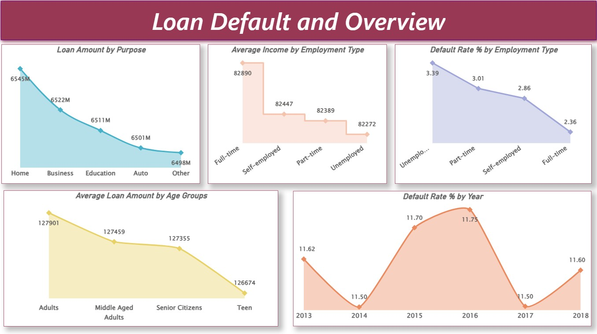
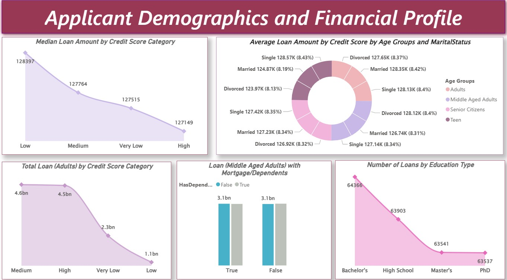

# 💳 Loan Risk & Default Analytics

A professional Power BI analytics project designed to evaluate borrower behavior, financial risk exposure, and loan default trends using customer demographics, income, and credit-related indicators.

This dashboard helps lenders and financial institutions identify high-risk borrowers, optimize approvals, and improve portfolio performance through data-driven decision-making.

---

# 📌 Business Objective

Banks and lending institutions need visibility into borrower repayment behavior and portfolio risk to reduce defaults and improve lending quality.

This dashboard enables stakeholders to:

- Identify high-risk borrower segments  
- Analyze default trends across customer profiles  
- Monitor portfolio health and repayment performance  
- Improve loan approval decision-making  
- Evaluate applicant demographics and financial strength  
- Support smarter lending strategies through analytics

---

# 📊 Dashboard Coverage

## Loan Portfolio Analytics

- Loan applications overview  
- Loan default distribution  
- Borrower income segmentation  
- Credit behavior patterns  
- Approval vs risk analysis  

## Borrower Risk Insights

- Applicant demographic trends  
- Income vs default analysis  
- Risk metrics by customer type  
- Borrower segmentation analysis  
- Financial profile comparison  

---

# 🔍 Key Insights

## Borrower Trends

- Lower income segments showed higher default probability.  
- Certain applicant profiles carried stronger repayment behavior.  
- Demographic patterns influenced approval and risk outcomes.  
- Borrowers with healthier financial indicators had lower default risk.  
- Segment-based analysis supports targeted lending decisions.

## Portfolio Insights

- Default concentration existed across select borrower groups.  
- Income and financial strength impacted portfolio quality.  
- Risk segmentation improves underwriting efficiency.  
- Better approvals can reduce future delinquency exposure.  
- Credit-focused analytics strengthens lending performance.

---

# 🛠 Tools & Skills Used

- Power BI  
- Power Query  
- DAX  
- Data Modeling  
- Financial Analytics  
- Data Cleaning  
- Risk Visualization  
- Dashboard Design  
- Business Storytelling  
- KPI Reporting  

---

# 📸 Dashboard Screenshots

## 💳 Loan Overview Dashboard

  

Provides a complete view of loan applications, borrower segments, approvals, and default distribution.

---

## 📉 Financial Risk Metrics Dashboard

  

Highlights borrower risk trends, portfolio financial indicators, and lending performance patterns.

---

## 👥 Applicant Demographics Dashboard

  

Analyzes customer demographics, income levels, and applicant segment behavior.

---

# 🎯 Business Impact

This dashboard helps financial institutions:

- Reduce default risk through smarter approvals  
- Improve borrower screening processes  
- Segment customers by financial behavior  
- Strengthen underwriting decisions  
- Monitor lending portfolio health  
- Use analytics for strategic growth

---

# 🚀 What This Project Demonstrates

- Financial analytics understanding  
- Credit risk reporting skills  
- KPI dashboard creation  
- Customer segmentation analysis  
- Lending portfolio insights  
- Executive reporting mindset  
- Business storytelling with data

---

# 🔗 Connect With Me

- LinkedIn: https://www.linkedin.com/in/shaurya-nanda/  
- Portfolio: https://shauryananda3.github.io/  
- GitHub: https://github.com/shauryananda3

---
