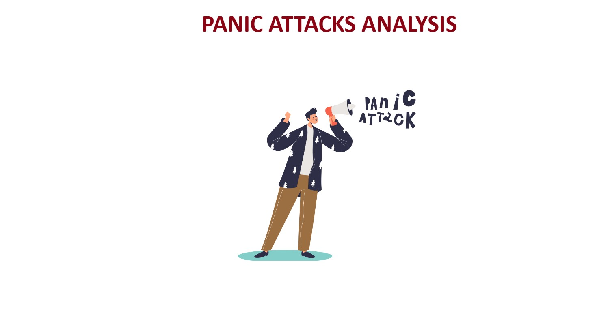
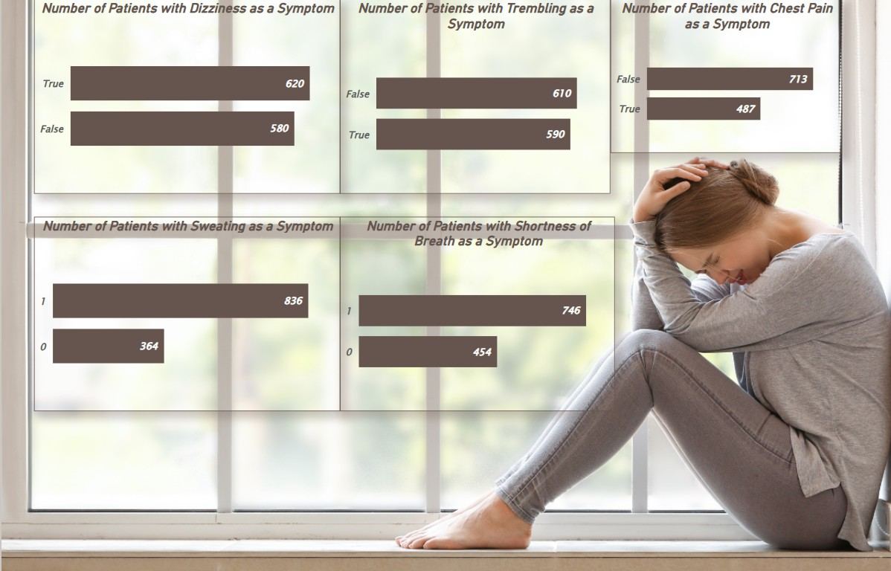
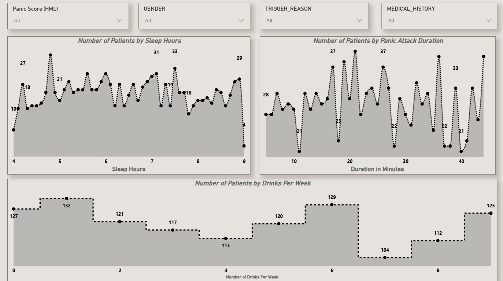
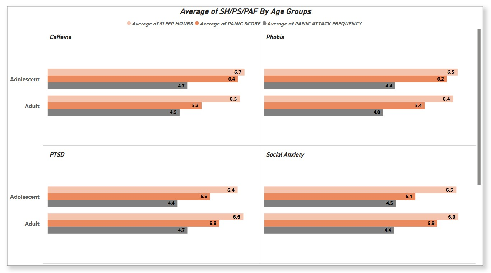

# 🧠 Mental Health & Wellness Analytics

A professional Power BI analytics project designed to evaluate panic attack patterns, lifestyle triggers, wellness indicators, and symptom trends using mental health datasets.

This dashboard helps healthcare professionals, wellness researchers, and decision-makers understand anxiety-related patterns, identify risk factors, and support preventive care strategies through data-driven insights.

---

# 📌 Business Objective

Mental health organizations and wellness stakeholders require visibility into symptom trends, behavioral triggers, and lifestyle factors to improve preventive care and patient support.

This dashboard enables stakeholders to:

- Analyze panic attack symptoms and frequency patterns  
- Identify lifestyle and behavioral triggers  
- Compare wellness indicators across patient groups  
- Evaluate duration and severity trends  
- Support early intervention strategies  
- Improve mental health planning using analytics

---

# 📊 Dashboard Coverage

## Patient Wellness Analytics

- Panic attack overview  
- Lifestyle trigger analysis  
- Sleep hour trends  
- Drinks per week patterns  
- Attack duration insights  

## Trigger & Symptom Insights

- Age group trigger comparison  
- Panic symptom analysis  
- Wellness behavior indicators  
- Trigger reason trends  
- Comparative patient insights  

---

# 🔍 Key Insights

## Wellness Insights

- Lower sleep duration showed stronger panic score correlation.  
- Certain lifestyle patterns aligned with higher episode frequency.  
- Panic duration varied significantly across individuals.  
- Behavioral indicators supported risk segmentation.  
- Preventive wellness monitoring improves outcomes.

## Symptom Insights

- Multiple symptoms frequently occurred together.  
- Trigger reasons influenced severity levels.  
- Age groups displayed different risk patterns.  
- Lifestyle behavior impacted wellness outcomes.  
- Data-backed screening supports early intervention.

---

# 🛠 Tools & Skills Used

- Power BI  
- Power Query  
- DAX  
- Data Modeling  
- Healthcare Analytics  
- Behavioral Analytics  
- Data Cleaning  
- Dashboard Design  
- KPI Reporting  
- Business Storytelling  

---

# 📸 Dashboard Screenshots

## 🧠 Mental Health Dashboard Cover

  

Introduces the analytics project focused on panic attacks, wellness trends, and preventive insights.

---

## ⚠ Panic Symptoms Analysis

  

Analyzes symptom occurrence including dizziness, trembling, chest pain, sweating, and breathlessness.

---

## 📊 Lifestyle Trigger Analysis

  

Evaluates sleep, drinks per week, panic duration, and lifestyle-based behavioral patterns.

---

## 👥 Age Group Trigger Comparison

  

Compares panic score, frequency, and wellness metrics across age groups and trigger categories.

---

# 🎯 Business Impact

This dashboard helps healthcare stakeholders:

- Improve preventive mental health strategies  
- Identify high-risk patient patterns  
- Support early intervention programs  
- Understand symptom frequency trends  
- Optimize wellness research insights  
- Enable data-driven care planning

---

# 🚀 What This Project Demonstrates

- Mental health analytics understanding  
- KPI dashboard creation  
- Healthcare reporting skills  
- Behavioral trend analysis  
- Executive reporting mindset  
- Business storytelling with visuals  
- Preventive care analytics capability

---

# 🔗 Connect With Me

- LinkedIn: https://www.linkedin.com/in/shaurya-nanda/  
- Portfolio: https://shauryananda3.github.io/  
- GitHub: https://github.com/shauryananda3

---
