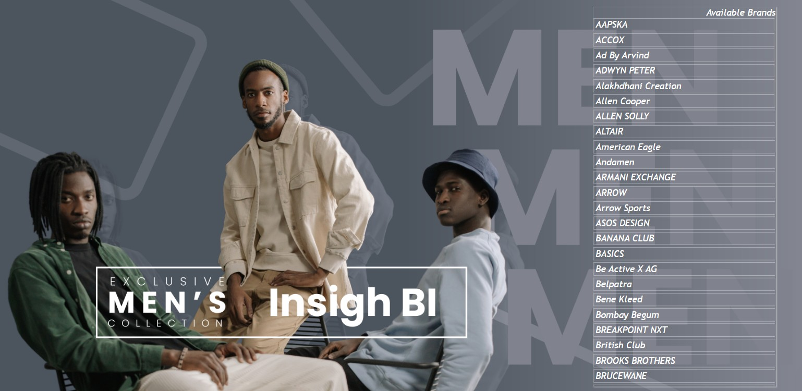

# 👔 Fashion Retail Sales, Pricing & Brand Performance Analytics

A premium Power BI dashboard built to analyze menswear retail brand performance across pricing, discounts, profitability, and product portfolio metrics.

This project helps retail stakeholders understand which brands drive revenue, which discount strategies impact margins, and where pricing opportunities exist for growth.

The report combines business storytelling with executive-level KPI reporting using a clean branded dashboard design.

---

# 📌 Business Objective

Retail companies need visibility into:

- High-performing brands
- Discount-heavy brands
- Profitability leaders and laggards
- Average selling price trends
- Product portfolio concentration
- Pricing optimization opportunities

This dashboard enables management teams to take data-driven merchandising and pricing decisions.

---

# 📊 Dashboard Pages

## Page 1: Executive Landing Page

Interactive brand showcase page featuring:

- Available brand portfolio
- Premium visual navigation
- Brand filtering experience
- Executive presentation layout

---

## Page 2: Brand Performance Dashboard

Core analytics page covering:

- Top 5 Brands by Average Discount
- Top 5 Brands by Average Profit %
- Bottom 5 Brands by Average Profit %
- Top 5 Brands by Highest Average Sales Price
- Top 5 Brands by Number of Items
- Brand contribution mix
- Average Discount KPI
- Average Sales Price KPI

---

# 📈 KPIs Tracked

- Average Discount %
- Average Profit %
- Average Sales Price
- Number of Products by Brand
- High Margin Brands
- Low Margin Brands
- Premium Price Brands
- Discount Heavy Brands

---

# 🔍 Key Insights Generated

- Certain brands offered aggressive discounts while maintaining sales volume.
- Premium brands delivered higher average selling prices with lower item count.
- Some brands showed weak profitability despite strong presence.
- Brand assortment concentration highlighted dependence on a few key labels.
- Pricing opportunities existed across mid-tier brands.
- Margin leakage identified in bottom-performing brands.

---

# 💼 Business Impact

This dashboard can help retail leadership:

- Optimize pricing strategy
- Improve gross margins
- Reduce excessive discounting
- Strengthen premium brand positioning
- Improve inventory mix planning
- Focus marketing on profitable brands

---

# 🛠 Tools & Skills Used

- Power BI
- Power Query
- DAX
- Data Modeling
- KPI Dashboard Design
- Pricing Analytics
- Profitability Analysis
- Data Visualization
- Retail Analytics

---

# 📷 Dashboard Screenshots

## Executive Landing Page

---

## Brand Performance Dashboard

---

# 🎯 What This Project Demonstrates

- Retail domain analytics understanding
- Pricing & discount intelligence
- Margin optimization reporting
- Executive dashboard storytelling
- Power BI visual design skills
- KPI driven decision support
- Commercial business analytics

---

# 🔗 Portfolio Links

**GitHub Portfolio:**  
https://github.com/shauryananda3

**Main Analytics Portfolio:**  
https://github.com/shauryananda3/PowerBI-Analytics-Projects

**Personal Portfolio Website:**  
https://shauryananda3.github.io/

---
