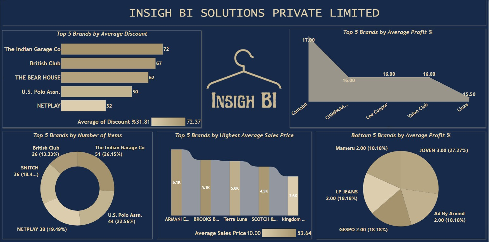

# 🛍️ Retail Sales & Profitability Analytics

A professional Power BI analytics project designed to evaluate retail sales performance, product profitability, and brand contribution using commercial sales datasets.

This dashboard helps business leaders, category managers, and retail analysts identify top-performing brands, improve product strategy, and maximize revenue growth through data-driven insights.

---

# 📌 Business Objective

Retail organizations require visibility into sales trends, brand performance, and profitability drivers to optimize merchandising and improve commercial outcomes.

This dashboard enables stakeholders to:

- Analyze sales performance by brand and category  
- Identify top revenue contributors  
- Compare profitability across products  
- Monitor business growth trends  
- Improve pricing and assortment strategy  
- Support data-driven retail decisions

---

# 📊 Dashboard Coverage

## Retail Performance Analytics

- Brand-wise sales contribution  
- Revenue and profit trends  
- Product category performance  
- Comparative brand analysis  
- Commercial KPI tracking  

## Strategic Insights

- High-performing brand identification  
- Product portfolio optimization  
- Sales opportunity analysis  
- Growth trend visibility  
- Profitability benchmarking  

---

# 🔍 Key Insights

## Sales Insights

- Certain brands generated stronger revenue contribution.  
- Product mix significantly influenced profitability.  
- Top categories delivered consistent commercial performance.  
- Dashboard visibility supports faster decisions.  
- Growth opportunities existed in underperforming segments.

## Strategic Insights

- Brand benchmarking improves portfolio planning.  
- Pricing decisions can influence margin performance.  
- Strong assortment mix drives sales growth.  
- Business visibility supports leadership planning.  
- Data-backed insights improve retail strategy.

---

# 🛠 Tools & Skills Used

- Power BI  
- Power Query  
- DAX  
- Data Modeling  
- Retail Analytics  
- Data Cleaning  
- Dashboard Design  
- KPI Reporting  
- Business Storytelling  
- Commercial Analysis  

---

# 📸 Dashboard Screenshots

## 🛍️ Retail Analytics Landing Page

  

Professional landing interface designed for navigation and business presentation.

---

## 📊 Brand Performance Dashboard

  

Analyzes brand contribution, sales trends, revenue mix, and profitability performance.

---

# 🎯 Business Impact

This dashboard helps retail teams:

- Improve brand strategy  
- Identify growth opportunities  
- Optimize product mix  
- Improve pricing decisions  
- Track profitability trends  
- Enable data-driven commercial planning

---

# 🚀 What This Project Demonstrates

- Retail analytics understanding  
- KPI dashboard creation  
- Commercial performance reporting  
- Executive reporting mindset  
- Business storytelling with visuals  
- Profitability analytics capability  
- Strategic decision support

---

# 🔗 Connect With Me

- LinkedIn: https://www.linkedin.com/in/shaurya-nanda/  
- Portfolio: https://shauryananda3.github.io/  
- GitHub: https://github.com/shauryananda3

---
