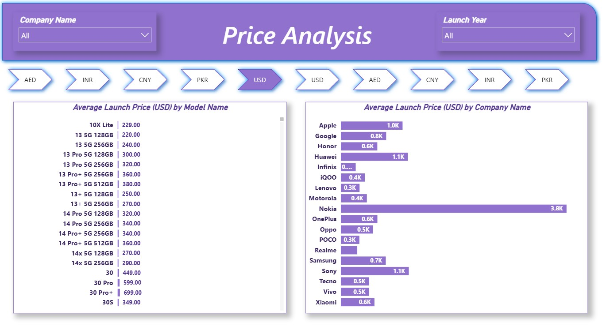

# 📱 Smartphone Market, Pricing & Product Feature Analytics Dashboard

A premium Power BI dashboard built to analyze global smartphone brands across product portfolio size, pricing strategy, hardware specifications, launch trends, and competitive positioning.

This project helps business leaders, product teams, and market analysts understand how smartphone brands compete on price, RAM, camera quality, processor variety, and product breadth.

The report combines product intelligence with executive storytelling through a multi-page interactive dashboard.

---

# 📌 Business Objective

Smartphone manufacturers and market analysts require visibility into:

- Brand portfolio size
- Pricing comparison across companies
- Feature-to-price competitiveness
- Hardware specification trends
- Camera and RAM evolution
- Launch year portfolio analysis
- Premium vs budget brand positioning

This dashboard enables data-driven product and pricing strategy decisions.

---

# 📊 Dashboard Pages

## Page 1: Smartphones Overview

Key insights covered:

- Number of Models by Companies
- RAM by Model Names
- Distinct Processor Count by Models
- Front Camera Resolution Trends
- Back Camera Resolution Trends

---

## Page 2: Product Catalog Details

Detailed product listing with:

- Company Name
- Model Name
- Front Camera
- Back Camera

---

## Page 3: Price Analysis

Commercial analytics covering:

- Average Launch Price by Model
- Average Launch Price by Company
- Multi-currency comparison (USD, AED, INR, CNY, PKR)

---

## Page 4: Features vs Price

Product benchmarking page covering:

- Weight
- Processor
- Screen Size
- Battery Capacity
- Front Camera
- Back Camera
- RAM filters
- Price filters

---

## Page 5: Executive Summary

Brand comparison table including:

- Average Price (USD)
- Average RAM (GB)
- Average Weight (grams)

---

# 📈 KPIs Tracked

- Number of Models by Brand
- Average Launch Price
- Average RAM
- Camera Resolution Mix
- Processor Diversity
- Battery Capacity Range
- Average Device Weight
- Feature-to-Price Positioning
- Multi-currency Pricing

---

# 🔍 Key Insights Generated

- Oppo, Apple, Honor, and Samsung maintained large product portfolios.
- Premium brands such as Apple and Samsung commanded higher average pricing.
- Nokia showed unusually high average pricing in available dataset mix.
- 32MP and 16MP front cameras appeared highly common across models.
- 50MP back camera models dominated modern launches.
- Brands balanced battery size, RAM, and pricing differently.
- Budget-focused brands offered strong specifications at lower price points.

---

# 💼 Business Impact

This dashboard can help stakeholders:

- Benchmark against competitors
- Optimize product pricing
- Plan future device launches
- Improve product segmentation
- Understand premium vs budget strategy
- Track feature trends consumers value
- Strengthen go-to-market planning

---

# 🛠 Tools & Skills Used

- Power BI
- Power Query
- DAX
- Data Modeling
- Product Analytics
- Market Intelligence
- Pricing Analytics
- Competitive Benchmarking
- Dashboard Storytelling
- Data Visualization

---

# 📷 Dashboard Screenshots

## Smartphones Overview

---

## Product Catalog

---

## Price Analysis

---

## Features vs Price

---

## Executive Summary

---

# 🎯 What This Project Demonstrates

- Product analytics understanding
- Market intelligence reporting
- Pricing strategy analysis
- Competitive benchmarking
- Multi-page Power BI reporting
- Executive dashboard storytelling
- Consumer electronics domain analytics

---

# 🔗 Portfolio Links

**GitHub Portfolio:**  
https://github.com/shauryananda3

**Main Analytics Portfolio:**  
https://github.com/shauryananda3/PowerBI-Analytics-Projects

**Personal Portfolio Website:**  
https://shauryananda3.github.io/

---
