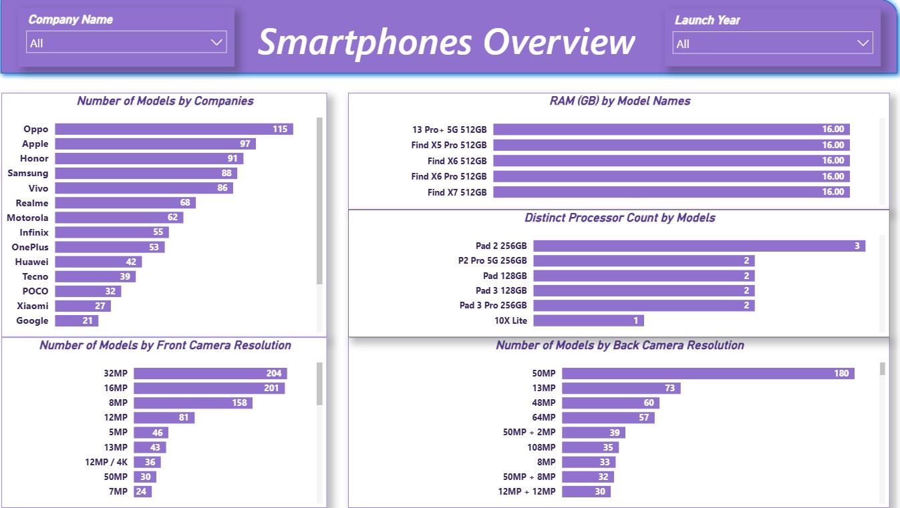
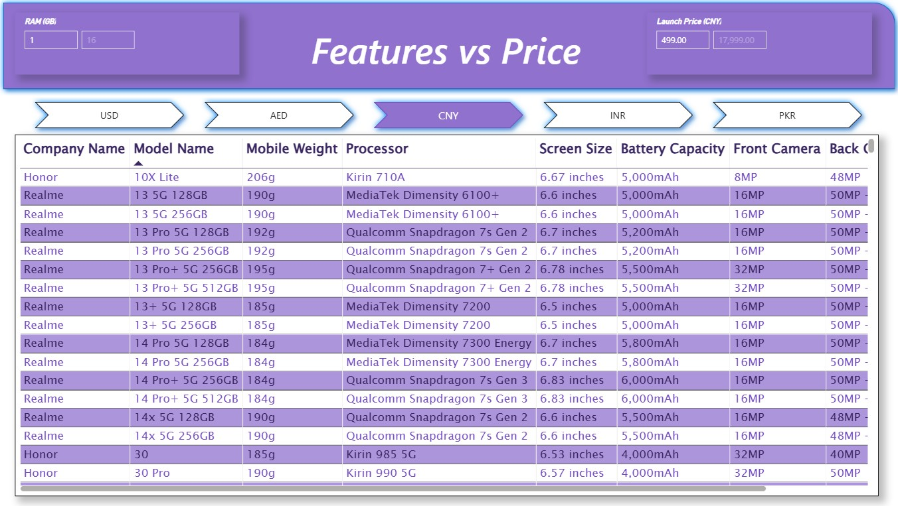
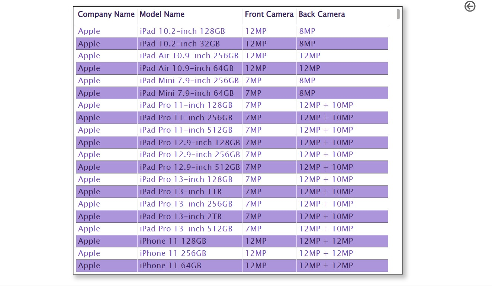
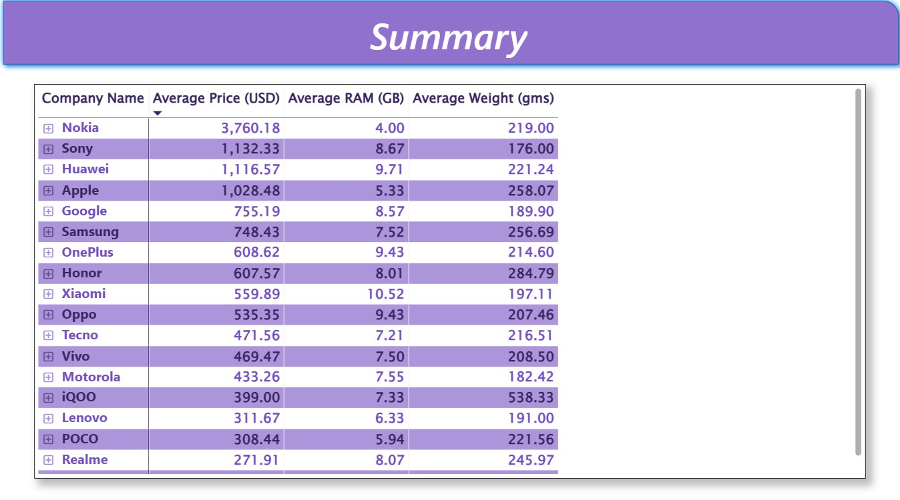

# 📱 Smartphone Market Intelligence Analytics

A professional Power BI analytics project designed to evaluate smartphone pricing, product specifications, feature trends, and brand positioning using mobile market datasets.

This dashboard helps product managers, market researchers, retailers, and business leaders understand competitive positioning, pricing strategy, and customer value trends in the smartphone industry.

---

# 📌 Business Objective

Smartphone businesses require visibility into pricing trends, feature comparisons, and product positioning to optimize portfolio strategy and improve market competitiveness.

This dashboard enables stakeholders to:

- Analyze smartphones by price and specifications  
- Compare features across brands and models  
- Identify value-for-money product segments  
- Evaluate product catalog trends  
- Support pricing and launch decisions  
- Use analytics for market strategy planning

---

# 📊 Dashboard Coverage

## Product Intelligence Analytics

- Smartphone overview dashboard  
- Product catalog comparison  
- Feature-wise analysis  
- Price segmentation insights  
- Brand/model benchmarking  

## Pricing Insights

- Features vs price comparison  
- Competitive positioning trends  
- Executive summary reporting  
- Premium vs budget segment analysis  
- Market opportunity visibility  

---

# 🔍 Key Insights

## Product Insights

- Higher-priced devices concentrated around premium features.  
- Mid-range segments offered strong value propositions.  
- Product specifications varied widely across models.  
- Feature benchmarking improved positioning clarity.  
- Catalog analysis supported portfolio optimization.

## Market Insights

- Price sensitivity creates multiple customer segments.  
- Feature-led pricing drives premium positioning.  
- Balanced specs improve competitiveness.  
- Data-backed pricing supports launch strategy.  
- Competitive analysis improves business decisions.

---

# 🛠 Tools & Skills Used

- Power BI  
- Power Query  
- DAX  
- Data Modeling  
- Product Analytics  
- Market Intelligence  
- Data Cleaning  
- Dashboard Design  
- KPI Reporting  
- Business Storytelling  

---

# 📸 Dashboard Screenshots

## 📱 Smartphones Overview Dashboard

  

Provides a complete market overview of smartphone models, pricing, and specifications.

---

## 💰 Price Analysis Dashboard

  

Evaluates pricing segments, premium positioning, and value opportunities.

---

## ⚙️ Features vs Price Dashboard

  

Compares device specifications against pricing across multiple models.

---

## 📋 Product Catalog Dashboard

  

Summarizes available products, specifications, and portfolio coverage.

---

## 📈 Executive Summary Dashboard

  

Presents high-level strategic insights for leadership decision-making.

---

# 🎯 Business Impact

This dashboard helps businesses:

- Improve smartphone pricing strategy  
- Benchmark competitors effectively  
- Optimize product portfolio decisions  
- Identify market gaps and opportunities  
- Support new product launches  
- Enable data-driven market planning

---

# 🚀 What This Project Demonstrates

- Market intelligence understanding  
- KPI dashboard creation  
- Product benchmarking capability  
- Executive reporting mindset  
- Business storytelling with visuals  
- Competitive analytics skills  
- Strategic pricing analysis

---

# 🔗 Connect With Me

- LinkedIn: https://www.linkedin.com/in/shaurya-nanda/  
- Portfolio: https://shauryananda3.github.io/  
- GitHub: https://github.com/shauryananda3

---
