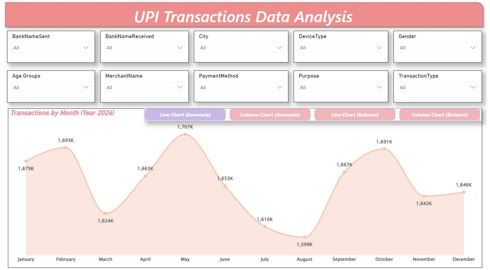

# 💸 UPI Transactions & Digital Payments Analytics Dashboard

A premium Power BI dashboard built to analyze UPI transaction behavior across banks, cities, merchants, customer segments, payment methods, and monthly transaction trends.

This project helps financial institutions, fintech companies, and payment stakeholders monitor digital transaction growth, customer usage patterns, balances, and transaction flow performance.

The report combines operational analytics with executive storytelling for India’s fast-growing digital payments ecosystem.

---

# 📌 Business Objective

UPI platforms and payment stakeholders require visibility into:

- Monthly transaction trends
- Bank-to-bank transfer behavior
- City-wise payment activity
- Merchant transaction performance
- Device and channel usage
- Customer segmentation insights
- Balance movement patterns
- Digital payment growth opportunities

This dashboard supports smarter product, growth, and operational decisions.

---

# 📊 Dashboard Pages

## Page 1: Monthly UPI Transaction Trends

Executive dashboard covering:

- Transactions by Month (2024)
- Amount trend analysis
- Balance trend analysis
- Dynamic visual switching
- Multi-filter transaction exploration

---

## Page 2: Bank, City & Balance Summary

Operational matrix dashboard covering:

- City-wise transaction activity
- Currency-level reporting
- Monthly amount movement
- Remaining balance tracking
- Multi-bank transfer analytics

---

# 📈 KPIs Tracked

- Total Transactions
- Monthly Transaction Volume
- Transaction Amount
- Remaining Balance
- City-wise Transactions
- Sending Bank Activity
- Receiving Bank Activity
- Merchant Transactions
- Payment Method Usage
- Device Type Usage

---

# 🔍 Key Insights Generated

- Transaction volumes peaked during selected months, indicating seasonal payment behavior.
- Certain cities contributed higher transaction value than others.
- Bank transfer patterns highlighted concentration among key institutions.
- Mobile device channels likely dominated digital payment activity.
- Merchant activity can reveal top commercial usage categories.
- Balance movement trends can support liquidity monitoring.

---

# 💼 Business Impact

This dashboard can help fintech and banking leadership:

- Improve customer payment experience
- Monitor UPI growth trends
- Optimize merchant partnerships
- Identify high-growth cities
- Strengthen transaction operations
- Support fraud/risk monitoring foundations
- Drive digital payment strategy

---

# 🛠 Tools & Skills Used

- Power BI
- Power Query
- DAX
- Data Modeling
- Financial Analytics
- Fintech Reporting
- KPI Dashboard Design
- Trend Analysis
- Interactive Filtering
- Data Visualization

---

# 📷 Dashboard Screenshots

## Monthly Transaction Trend Dashboard

---

## Bank & Balance Summary Dashboard

---

# 🎯 What This Project Demonstrates

- Fintech analytics understanding
- Digital payments reporting
- Transaction trend analysis
- Multi-dimensional filtering
- Executive dashboard storytelling
- Power BI visualization skills
- KPI-driven business reporting

---

# 🔗 Portfolio Links

**GitHub Portfolio:**  
https://github.com/shauryananda3

**Main Analytics Portfolio:**  
https://github.com/shauryananda3/PowerBI-Analytics-Projects

**Personal Portfolio Website:**  
https://shauryananda3.github.io/

---
