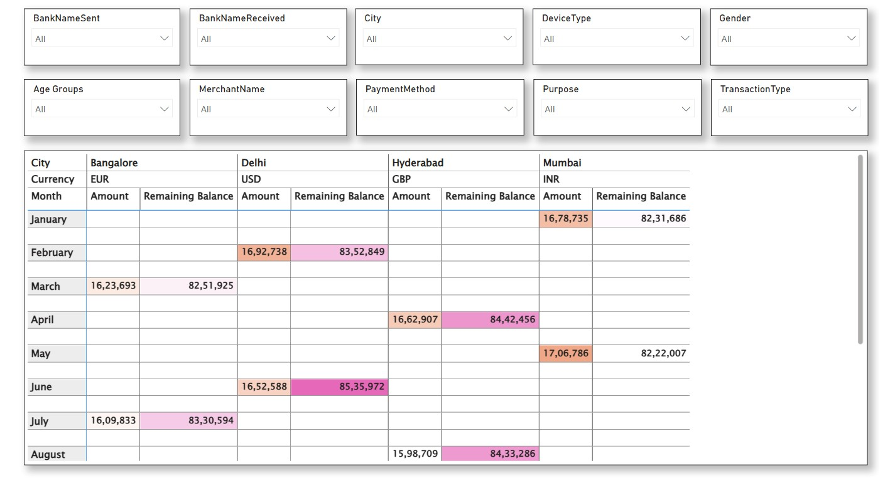

# 💳 UPI Digital Payments Analytics

A professional Power BI analytics project designed to evaluate transaction trends, monthly payment activity, and account balance movement using UPI digital payment datasets.

This dashboard helps fintech teams, banks, payment companies, and business leaders understand transaction behavior, monitor payment growth, and support data-driven financial decisions.

---

# 📌 Business Objective

Digital payment organizations require visibility into transaction volume, balance movement, and customer payment behavior to optimize growth strategy and improve operational efficiency.

This dashboard enables stakeholders to:

- Analyze monthly UPI transaction activity  
- Monitor account balance movement  
- Identify payment growth trends  
- Evaluate transaction seasonality patterns  
- Improve customer usage insights  
- Support strategic decisions using analytics

---

# 📊 Dashboard Coverage

## Payments Performance Analytics

- Monthly transactions dashboard  
- Transaction trend monitoring  
- Payment activity patterns  
- Time-based performance analysis  
- Growth visibility reporting  

## Financial Monitoring Insights

- Bank balance summary dashboard  
- Account movement analysis  
- Cash flow visibility  
- Usage trend insights  
- Financial behavior tracking  

---

# 🔍 Key Insights

## Transaction Insights

- Monthly payment activity showed recurring trend patterns.  
- Digital adoption supported increasing transaction behavior.  
- Seasonal movement influenced monthly volumes.  
- Dashboard visibility improved performance monitoring.  
- Transaction trends support future growth planning.

## Financial Insights

- Balance movement reflected customer payment cycles.  
- Strong digital usage improved ecosystem engagement.  
- Monitoring cash movement supports planning decisions.  
- Payment analytics improve customer understanding.  
- Data-backed insights enhance fintech strategy.

---

# 🛠 Tools & Skills Used

- Power BI  
- Power Query  
- DAX  
- Data Modeling  
- Fintech Analytics  
- Digital Payments Analytics  
- Data Cleaning  
- Dashboard Design  
- KPI Reporting  
- Business Storytelling  

---

# 📸 Dashboard Screenshots

## 💳 Monthly Transactions Dashboard

  

Tracks monthly UPI payment activity, transaction movement, and growth trends.

---

## 🏦 Bank Balance Summary Dashboard

  

Provides visibility into account balances, movement trends, and financial monitoring.

---

# 🎯 Business Impact

This dashboard helps fintech businesses:

- Improve payment growth tracking  
- Understand customer transaction behavior  
- Monitor account movement trends  
- Support financial planning decisions  
- Enhance digital payment strategy  
- Enable data-driven business growth

---

# 🚀 What This Project Demonstrates

- Fintech analytics understanding  
- KPI dashboard creation  
- Payment trend reporting  
- Executive reporting mindset  
- Business storytelling with visuals  
- Financial analytics capability  
- Strategic decision support

---

# 🔗 Connect With Me

- LinkedIn: https://www.linkedin.com/in/shaurya-nanda/  
- Portfolio: https://shauryananda3.github.io/  
- GitHub: https://github.com/shauryananda3

---
