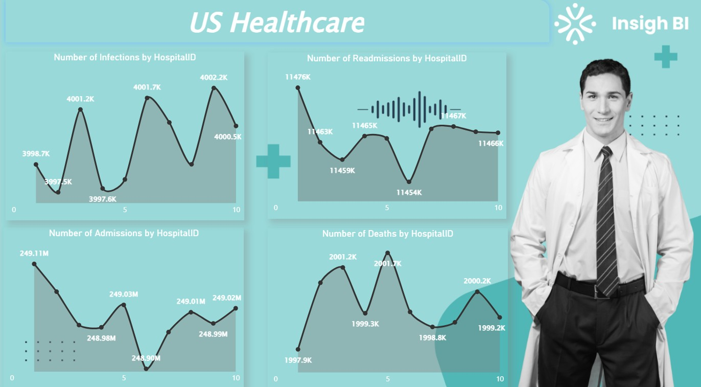
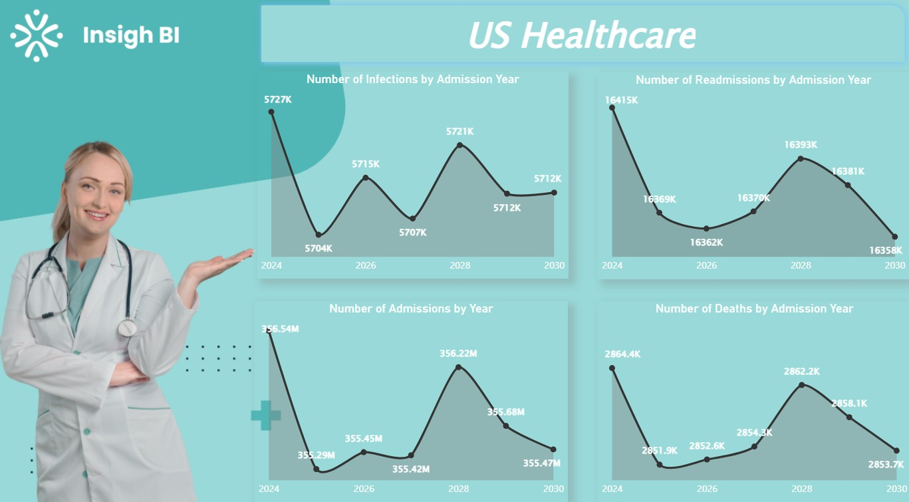

# 🏥 US Healthcare Performance Analytics

A professional Power BI analytics project designed to evaluate hospital operations, patient outcomes, and healthcare performance using clinical and operational datasets.

This dashboard helps healthcare leaders, administrators, and analysts monitor service quality, benchmark facilities, and support data-driven planning to improve patient care and operational efficiency.

---

# 📌 Business Objective

Healthcare organizations require visibility into hospital performance, patient outcomes, and operational trends to improve care delivery and optimize decision-making.

This dashboard enables stakeholders to:

- Analyze hospital-level healthcare KPIs  
- Monitor admissions, infections, and readmissions  
- Compare facility performance metrics  
- Evaluate yearly healthcare trends  
- Improve operational planning and resource allocation  
- Support leadership decisions using analytics

---

# 📊 Dashboard Coverage

## Hospital Performance Analytics

- Hospital-wise performance comparison  
- Infection trend monitoring  
- Readmission analysis  
- Admissions performance tracking  
- Mortality visibility reporting  

## Strategic Healthcare Insights

- Yearly operational trend analysis  
- Benchmarking across hospitals  
- Capacity planning visibility  
- Patient outcome monitoring  
- Quality improvement insights  

---

# 🔍 Key Insights

## Operational Insights

- Certain hospitals reported higher infection and readmission patterns.  
- Admissions volume varied across facilities.  
- Operational benchmarking identified improvement opportunities.  
- Yearly demand trends supported planning visibility.  
- Data transparency improved healthcare governance.

## Patient Outcome Insights

- Mortality trends remained stable with periodic variation.  
- Readmission analysis highlighted care continuity gaps.  
- Infection monitoring supports quality improvement programs.  
- Facility comparisons improve accountability.  
- Data-backed planning enhances patient outcomes.

---

# 🛠 Tools & Skills Used

- Power BI  
- Power Query  
- DAX  
- Data Modeling  
- Healthcare Analytics  
- Data Cleaning  
- Dashboard Design  
- KPI Reporting  
- Business Storytelling  
- Operational Analytics  

---

# 📸 Dashboard Screenshots

## 🏥 Hospital Performance Dashboard

  

Compares hospitals using admissions, infections, readmissions, and mortality metrics.

---

## 📈 Yearly Trends Dashboard

  

Tracks annual healthcare performance patterns for planning and benchmarking.

---

# 🎯 Business Impact

This dashboard helps healthcare organizations:

- Improve patient care quality  
- Reduce readmission risk  
- Benchmark hospitals effectively  
- Strengthen planning and staffing decisions  
- Monitor critical healthcare KPIs  
- Enable data-driven leadership decisions

---

# 🚀 What This Project Demonstrates

- Healthcare analytics understanding  
- KPI dashboard creation  
- Operational performance reporting  
- Executive reporting mindset  
- Business storytelling with visuals  
- Trend analysis capability  
- Strategic decision support

---

# 🔗 Connect With Me

- LinkedIn: https://www.linkedin.com/in/shaurya-nanda/  
- Portfolio: https://shauryananda3.github.io/  
- GitHub: https://github.com/shauryananda3

---
